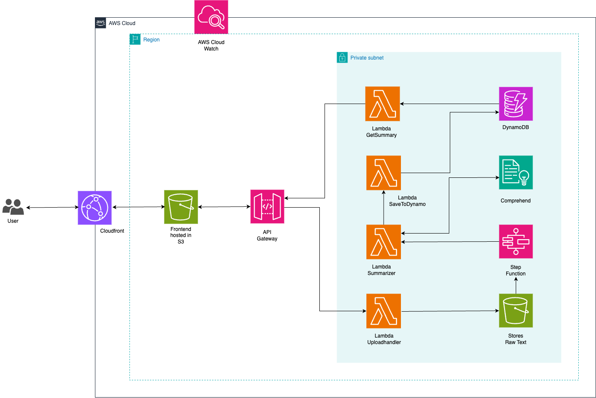

# AWS based Text Sentiment Analyzer

This project is a **Text Sentiment Analyzer** application that allows users to upload text files, analyze their sentiment using AWS Comprehend, and store the results in DynamoDB. The project is built with a serverless architecture using AWS services and includes a React-based frontend for user interaction.

## Features

- **File Upload**: Users can upload `.txt` files via the frontend.
- **Sentiment Analysis**: The uploaded text is analyzed for sentiment (Positive, Negative, Neutral, or Mixed) using AWS Comprehend.
- **Confidence Scores**: The sentiment analysis includes confidence scores for each sentiment type.
- **Data Storage**: The results are stored in a DynamoDB table for future retrieval.
- **API Integration**: The backend is integrated with AWS API Gateway for seamless communication between the frontend and AWS Lambda functions.

## Architecture

The project uses a serverless architecture with the following AWS services:

- **AWS Lambda**: Handles file uploads, sentiment analysis, and saving results to DynamoDB.
- **AWS S3**: Stores uploaded text files.
- **AWS Comprehend**: Performs sentiment analysis on the text.
- **AWS DynamoDB**: Stores the sentiment analysis results.
- **AWS API Gateway**: Provides RESTful APIs for the frontend to interact with the backend.
- **AWS Step Functions**: Orchestrates the workflow for sentiment analysis and data storage.

### Architecture Diagram



## Project Structure

### Backend

- **`upload_handler.py`**: Handles file uploads to S3.
- **`summarizer.py`**: Performs sentiment analysis using AWS Comprehend.
- **`save_to_dynamo.py`**: Saves the sentiment analysis results to DynamoDB.
- **`get_summary.py`**: Retrieves sentiment analysis results from DynamoDB.
- **CloudFormation Templates**:
  - `main.yaml`: Defines the infrastructure for the project.
  - `main1.yaml`: An alternative or extended version of the infrastructure.

### Frontend

- Built with **React**.
- Allows users to upload files and view sentiment analysis results.
- Key files:
  - **`App.js`**: Main component handling file uploads and displaying results.
  - **`index.js`**: Entry point for the React application.
  - **CSS Files**: Styling for the application.

### Other Files

- **`package.json`**: Manages frontend dependencies.
- **`setupTests.js`**: Configures testing for the React app.
- **`reportWebVitals.js`**: Measures app performance.

## How It Works

1. **File Upload**: Users upload a `.txt` file via the React frontend.
2. **File Storage**: The file is sent to an S3 bucket using the `upload_handler.py` Lambda function.
3. **Sentiment Analysis**: The `summarizer.py` Lambda function retrieves the file from S3, analyzes its sentiment using AWS Comprehend, and returns the results.
4. **Data Storage**: The `save_to_dynamo.py` Lambda function stores the sentiment results in DynamoDB.
5. **Result Retrieval**: Users can retrieve the sentiment analysis results via the `get_summary.py` Lambda function.

## Deployment

The project uses AWS CloudFormation templates (`main.yaml` and `main1.yaml`) to deploy the infrastructure. These templates define resources such as S3 buckets, DynamoDB tables, Lambda functions, API Gateway, and Step Functions.

### Prerequisites

- AWS CLI configured with appropriate permissions.
- Node.js and npm installed for the frontend.
- An S3 bucket to store Lambda function code.

### Steps

1. **Backend Deployment**:
   - Package and upload Lambda function code to the S3 bucket.
   - Deploy the CloudFormation stack using `main.yaml` or `main1.yaml`.

2. **Frontend Deployment**:
   - Navigate to the `frontend` directory.
   - Install dependencies: `npm install`.
   - Start the development server: `npm start`.

## API Endpoints

- **POST /upload**: Uploads a text file to S3.
- **POST /summary**: Retrieves sentiment analysis results for a file.

## Technologies Used

- **Frontend**: React, Axios
- **Backend**: Python, AWS Lambda, AWS Comprehend, AWS DynamoDB, AWS S3
- **Infrastructure**: AWS CloudFormation, AWS API Gateway, AWS Step Functions

## Future Enhancements

- Add support for multiple languages in sentiment analysis.
- Implement user authentication for secure access.
- Enhance the frontend with better UI/UX.
- Add a feature to visualize sentiment trends over time.

## Getting Started

1. Clone the repository:
   ```bash
   git clone https://github.com/your-username/text-sentiment-analyzer.git
